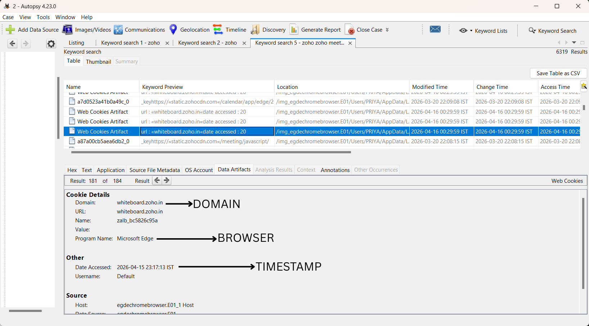

# Digital Forensic Investigation of a Videoconferencing Web Application

*M.Sc. Dissertation — National Forensic Sciences University, Gandhinagar (2026)*
*Supervised by Dr. Kapil Shukla, School of Forensic Science*

> This repository presents a summary of my M.Sc. dissertation research. The full dissertation was submitted to NFSU as part of my degree requirements; this repo shares the objectives, methodology, and key findings in my own words for portfolio purposes.

---

## 📌 Overview

Web-based videoconferencing platforms are widely used but under-studied from a forensic standpoint. This research investigated how browser-based videoconferencing activity — specifically on **Zoho Meeting** — can be reconstructed through a combination of **browser artifact analysis** and **memory (RAM) forensics**, across two browsers: **Microsoft Edge** and **Google Chrome**.

The goal was to determine what forensic evidence persists on disk versus what only exists transiently in memory, and to build a reliable, cross-browser methodology for reconstructing user activity during a live videoconferencing session.

---

## 🖼️ Evidence Highlights

**Correlated timeline reconstruction across memory, browser, and Autopsy evidence:**

**Recovered web cookie artifact — domain, browser, and timestamp correlation (Autopsy):**

---

## 🎯 Objectives

- Detect and extract browser artifacts (history, cookies, cache, local storage) generated during a Zoho Meeting session.
- Analyze volatile memory to recover transient data — session tokens, meeting identifiers, and partial chat/communication content.
- Compare artifact generation and retention across Microsoft Edge and Google Chrome.
- Correlate disk-based and memory-based evidence into a coherent timeline of user activity.
- Evaluate the forensic reliability and evidentiary value of the recovered artifacts.

---

## 🧩 Methodology

- Built a controlled, virtualized **Windows 10 x64** environment to simulate realistic user activity (joining/hosting a meeting, chat, screen sharing, whiteboard collaboration).
- Captured a **live RAM image** during an active Zoho Meeting session running simultaneously in both browsers.
- Performed **disk imaging** using **FTK Imager**.
- Performed **memory analysis** using **Volatility 3** (process listing, profile identification, keyword/string search).
- Performed **browser artifact analysis** using **Autopsy** (cache, cookies, history, log files).
- Cross-correlated memory and disk findings to reconstruct a unified activity timeline.

---

## 🔍 Key Findings

- **Memory forensics recovered artifacts that disk analysis alone could not** — including live chat content in plaintext, active session tokens, and user email identifiers, all recoverable directly from `chrome.exe` and `msedge.exe` process memory.
- **Meeting URLs and keyword traces** ("zoho", "meeting") appeared at high frequency in memory from both browsers, confirming active application use at capture time.
- **Screen sharing and whiteboard activity left only indirect artifacts** — detectable through process behavior and memory patterns rather than explicit readable data — showing that some real-time features are forensically "quieter" than others.
- **Artifact patterns were consistent across both Chrome and Edge**, indicating that evidence generation is driven more by the *application* (Zoho Meeting's architecture) than by the specific browser — both are Chromium-based, which explains the similarity.
- Correlating memory and disk evidence allowed reconstruction of a **full, uninterrupted session timeline** — from initial meeting access through to chat/screen-sharing activity — with no evidence of anomalous or malicious interference.
- The study demonstrated that **a hybrid disk + memory forensic approach is necessary** for videoconferencing investigations, since disk artifacts alone under-represent real-time session activity, and memory alone lacks persistence after system shutdown.

---

## 🧰 Tools Used

`FTK Imager` · `Volatility 3` · `Autopsy` · Windows 10 x64 (Virtual Machine)

---

## 🧠 Skills Demonstrated

`Memory Forensics` · `Browser Forensics` · `Digital Evidence Correlation` · `Timeline Reconstruction` · `Forensic Tool Proficiency (FTK, Volatility, Autopsy)` · `Academic Research & Technical Writing`

---

## 📎 Files in This Repository

| File | Description |
|:---|:---|
| `README.md` | This summary |
| `figures/timeline_reconstruction_summary.png` | Full evidence-correlation timeline diagram |
| `figures/autopsy_cookie_artifact.png` | Recovered browser cookie artifact (Autopsy) |

> The full dissertation document is not published in this repository. It's available on request — feel free to reach out via [LinkedIn](https://www.linkedin.com/in/priya-kumari-749525275) or [email](mailto:priyakofficial.2026@gmail.com).
